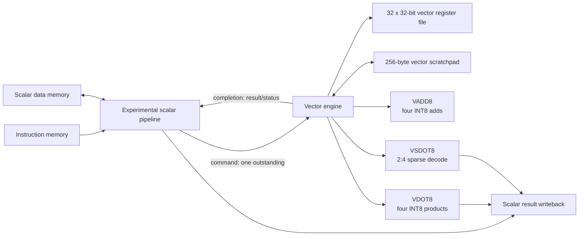
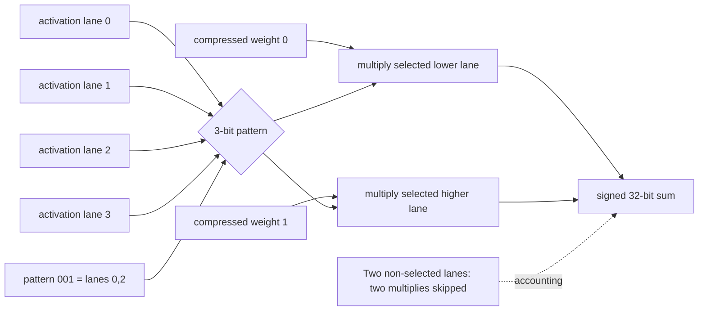

# Sparrow-V Architecture Overview

Sparrow-V has two scalar implementations. `rv32_core` is the protected,
production/reference three-stage RV32I core. `rv32_core_pipe` is the
experimental integration core used for scalar/vector workloads. It is
single-issue, in-order, blocking, and non-speculative at the scalar/vector
boundary; it is not promoted to replace the reference core.

## System overview

The diagram depicts `rv32_core_pipe`; the reference core does not issue vector
commands. Scalar `dmem` and the vector scratchpad are separate state spaces.

## Command and state ownership

The pipe captures scalar operands and vector indices, holds the command stable
until the engine accepts it, then blocks scalar issue. The engine returns a
stable completion until accepted. Successful vector-state updates and scalar
result writeback occur only on that completion handshake. Exceptions are
precise; reset cancels outstanding work and a wrong-path instruction cannot
issue a command.

The engine exclusively owns 32 writable 32-bit vector registers (`v0`–`v31`)
and a 256-byte byte-addressed, little-endian scratchpad. The scalar owns
scalar registers, scalar retirement, traps, and scalar `dmem`. Test-only debug
ports are not architectural interfaces.

## Data paths

`VADD8` performs four modulo-256 lane additions. `VDOT8` interprets four
little-endian lanes as signed INT8 values, forms four signed products, and
returns their exact signed 32-bit sum. `VLOAD32`/`VSTORE32` transfer aligned
32-bit words to/from the vector-only scratchpad; misalignment and range/wrap
fail precisely.

`VSDOT8` consumes one activation word, two compressed weights in bytes 0 and
1 of a weight word, and a legal three-bit 2-of-4 pattern. Weight 0 maps to the
lower selected lane and weight 1 to the higher selected lane. It returns a
signed 32-bit scalar sum after two executed products; invalid patterns `110`
and `111` raise cause 18.

## Sparse dataflow

All legal mappings are `000={0,1}`, `001={0,2}`, `010={0,3}`, `011={1,2}`,
`100={1,3}`, and `101={2,3}`. The example in the figure uses `001`; it does
not imply a fixed pattern in software.

## Further detail

- [Scalar/vector command-completion contract](architecture/scalar_vector_interface.md)
- [VADD8 and VDOT8 semantics](architecture/vector_vadd8.md)
- [VSDOT8 metadata and accounting](architecture/vector_vsdot8.md)
- [Vector scratchpad transfers](architecture/vector_memory.md)
- [Workload layout and measurement definition](architecture/sparse_fc_workload.md)
